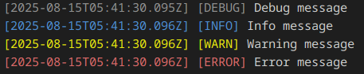

# Enhanced Logger

A customizable logger for JavaScript projects that works in both Node.js and browser environments.

```javascript
const { logger } = require('enhanced-logger');

logger.debug('Debug message');
logger.info('Info message');
logger.warn('Warning message');
logger.error('Error message');
```


## Features

- Multiple log levels (debug, info, warn, error, ...and your custom level)
- Pre-configured logger instance
- `createLogger` utility function
- TypeScript support
- ES Module and CommonJS support

## Installation

```bash
npm install enhanced-logger
```

## Basic Usage

### Using default logger instance
```javascript
// CommonJS
const { logger } = require('enhanced-logger');
logger.info('Info message');

// ES Modules
import { logger } from 'enhanced-logger';
logger.warn('Warning message');
```

### Using individual methods
```javascript
// CommonJS
const { debug } = require('enhanced-logger');
debug('Debug message');

// ES Modules
import { error } from 'enhanced-logger';
error('Error message');
```

### Using createLogger utility
```javascript
// CommonJS
const { createLogger } = require('enhanced-logger');
const logger = createLogger({ minLevel: 'warn' });

// ES Modules
import { createLogger } from 'enhanced-logger';
const logger = createLogger({ timestamp: false });
```

## API Reference

### Default Exports
- `logger` - Pre-configured logger instance
- `debug`, `info`, `warn`, `error` - Individual log methods
- `createLogger(options)` - Creates a new logger instance

### Logger Options
- `minLevel` - Minimum log level to display
- `timestamp` - Show timestamps (default: true)
- `customLevels` - Additional log levels

## License
MIT